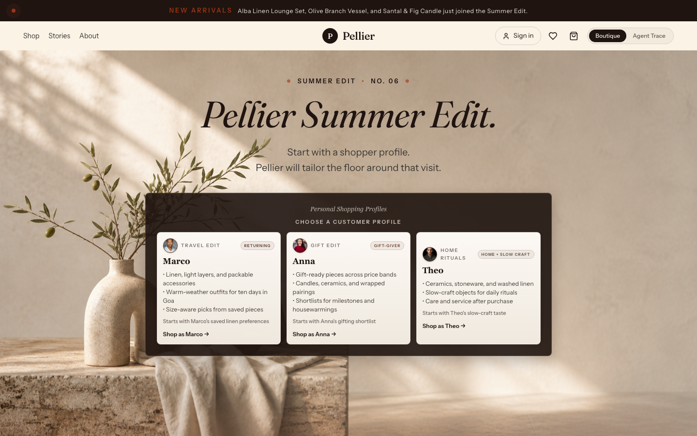

# Pellier - Build Agentic Search on Aurora PostgreSQL

<div align="center">

_A 60-minute L400 guided build with Aurora PostgreSQL, pgvector, Amazon Bedrock, and Strands Agents_

<br/>

[](https://docs.aws.amazon.com/AmazonRDS/latest/AuroraUserGuide/AuroraPostgreSQL.VectorDB.html)
[](https://strandsagents.com)
[](https://www.python.org/)
[](LICENSE)

</div>

> This is the application behind a 60-minute L400 Builder's Session. At the
> event, your environment is already deployed. Follow the Workshop Studio lab
> guide; you do not need to run the local setup on this page.

**Contents:** [Your workshop](#your-workshop) · [Meet Pellier](#meet-pellier) ·
[What is already built](#what-is-already-built) ·
[How a request runs](#how-a-request-runs) · [Architecture](#architecture) ·
[Run locally](#run-locally) · [Repository layout](#repository-layout)

---

## Your workshop

You will repair and prove one agentic search path in an application that is
already running. The L400 depth comes from examining retrieval choices,
orchestration boundaries, deterministic tools, and durable evidence, not from
assembling infrastructure during the session.

You should be comfortable reading Python and SQL, using a terminal, and
calling an API. You do not need prior experience with Pellier, Strands Agents,
Bedrock AgentCore, or MCP.

| Clock | Section | What you will prove |
|---:|---|---|
| 0-8 | Start Here | Your Code Editor, Boutique, catalog, and starter state are ready |
| 8-26 | **Ground Answers in Live Data** | `floor_check` returns a real Brooklyn quantity and ship window |
| 26-36 | **Design the Retrieval Strategy** | Four retrieval strategies produce a defensible architecture decision |
| 36-48 | **Trace Agent Actions** | Aurora preserves working memory and a session-specific `process_return` receipt |
| 48-55 | Protected recovery | Every participant lands the three required proofs |
| 55-60 | Summary | You can transfer the grounding, retrieval, and audit pattern to another workload |

Only the `floor_check` body starts incomplete. The guide includes a recovery
path for every time-sensitive step, so use it if a step takes more than two or
three minutes. Exact commands and participant instructions live in the paired
Workshop Studio guide.

The timed path uses only **Code Editor** and **Boutique**. **Agent Trace is
optional** and is not required to complete the hour; the required terminal
commands call its read-only APIs directly.

---

## Meet Pellier

Pellier is an editorial retail application with two views:

- **Boutique** (`/`) is where you send shopper requests and inspect grounded
  answers.
- **Agent Trace** (`/agent-trace`) is the engineering view for routing, retrieval,
  tools, evidence, and optional production patterns. It opens on a proof-first
  board for post-session exploration.



Three shoppers carry the workshop narrative:

| Shopper | Request | What you inspect |
|---|---|---|
| **Marco** | Is the Hadley shirt in the Brooklyn warehouse? | Dispatcher routing, a Strands `@tool`, and live inventory |
| **Anna** | Find a milestone gift for a new homeowner | Vector, hybrid, reranked, and agentic retrieval |
| **Theo** | File a damaged return for a chipped bowl | Durable session messages and a queryable tool receipt in Aurora |

The database contains **40 products**, ten each for Fresh, Marco, Anna, and
Theo. The storefront renders nine showcase cards from each cohort (36 total);
the other four products remain available to retrieval. The committed Cohere
Embed v4 cache makes workshop seeding deterministic and avoids corpus
embedding calls during bootstrap.

---

## What is already built

| Capability | What you can inspect |
|---|---|
| Semantic retrieval | Cohere Embed v4 query embeddings, `vector(1024)`, pgvector HNSW, and cosine distance in `pellier.product_catalog` |
| Hybrid retrieval | Aurora runs pgvector and PostgreSQL full-text branches; Python combines their rank positions with Reciprocal Rank Fusion |
| Retrieval refinement | Cohere Rerank v3.5 reorders hybrid candidates; Claude Sonnet 5 can extract structured filters for agentic retrieval |
| Agentic tool use | Five Strands specialists share 15 declared `@tool` functions for search, inventory, pricing, returns, evidence, and escalation |
| Working memory | `pellier.conversations` and `pellier.messages` atomically preserve successful turn pairs and supply bounded history to the next Boutique turn |
| Durable evidence | `pellier.tool_audit` records the tool, caller, JSONB arguments and result, latency, session, and timestamp |
| Runtime skills | A Sonnet-based SkillRouter selects from five markdown prompt overlays and injects matching guidance into the selected specialist |
| Tool registry teaching view | Aurora pgvector ranks tool descriptions for Agent Trace; the default Dispatcher still calls its fixed in-process tool set |
| Optional production extensions | AgentCore Runtime, Memory, Gateway, Identity, Policy, Evals, and MCP reference and deployment code remain opt-in |

The deployed workshop database is Aurora PostgreSQL. The schema, pgvector,
full-text search, JSONB, and SQL patterns also apply to Amazon RDS for
PostgreSQL, but the supplied Workshop Studio infrastructure is
Aurora-specific.

The required hour uses only bounded Aurora working memory. In the optional
Agent Trace reference, semantic memory means learned preferences, episodic
memory means customer events, and procedural memory means checked-in runtime
skills plus MCP schemas. `tool_audit` is operational history, not memory.

---

## How a request runs

1. The Boutique sends your shopper request to FastAPI.
2. FastAPI loads the session's recent working-memory turns from Aurora.
3. The deterministic Dispatcher classifies the intent and selects one of five
   specialists.
4. A Sonnet-based SkillRouter can add matching guidance for the current turn.
5. The specialist calls only its declared in-process tools.
6. Aurora stores the completed turn and any tool evidence.
7. Boutique streams the answer; Agent Trace exposes the engineering detail.

The required workshop path deliberately stays **in-process**. Your Python edit
reloads immediately, retries are cheap, and everyone can complete the same
three proofs within the locked hour.

AgentCore Runtime is a managed execution envelope, not a replacement for the
Dispatcher. The same routing and tool contracts can run inside Runtime and use
AgentCore Memory, Gateway, Identity, Policy, Evals, and MCP. This repository
includes those opt-in implementation and deployment references, but making
them required in the locked hour would add deployment, authentication, and
recovery work without changing the three outcomes you are here to learn.

---

## Architecture

### Routing and agents

The Boutique uses the **Dispatcher** pattern: deterministic intent
classification selects one specialist, then that specialist makes the model
and tool calls for the turn. Agent Trace can also exercise **Agents as Tools** and
a Strands **GraphBuilder** pattern for comparison.

| Specialist | Responsibility | Default model role |
|---|---|---|
| Style Advisor | Semantic search, fit, fabric, comparisons | Claude Opus 5 editorial profile |
| Curator | Pairing, occasion, hybrid retrieval | Claude Opus 5 editorial profile |
| Value Analyst | Pricing and collection analysis | Claude Sonnet 5 reporting profile |
| Stock Keeper | Warehouse inventory and restocking | Claude Sonnet 5 reporting profile |
| Experience Guide | Care, returns, and escalation | Claude Opus 5 editorial profile |

`scripts/check_model_access.py` can replace the Opus profile with an accessible
Sonnet fallback before startup. Query embeddings use Cohere Embed v4 and
reranking uses Cohere Rerank v3.5.

### Tools

The 15 in-process tools are:

`find_pieces` · `find_pieces_hybrid` · `style_match` · `whats_trending` ·
`price_intelligence` · `explore_collection` · `side_by_side` · `floor_check` ·
`restock_shelf` · `running_low` · `returns_and_care` · `process_return` ·
`preference_snapshot` · `trace_receipt` · `escalate_to_stylist`

The Aurora tool registry is a separate teaching and comparison surface. It
semantically ranks tool descriptions but does not replace the fixed tool grants
used by the default Boutique runtime.

### Skills

Five markdown skills live under [`skills/`](skills/):

`the-packing-list` · `the-gift-table` · `the-makers-shelf` ·
`the-care-card` · `the-proof-counter`

The SkillRouter evaluates each turn and injects only selected skill bodies into
the specialist prompt. A routing or parse failure leaves skills unloaded and
does not block the base agent path.

### Stack

| Layer | Current implementation |
|---|---|
| Database | Aurora PostgreSQL Serverless v2, engine 18.3 in the Workshop Studio stack |
| Vector retrieval | pgvector 0.8.1, `vector(1024)`, HNSW `(m=16, ef_construction=64)`, cosine `<=>` |
| Lexical retrieval | PostgreSQL `tsvector`, GIN, `ts_rank_cd`, and `pg_trgm` |
| Hybrid merge | Application-layer Reciprocal Rank Fusion over vector and FTS rank lists |
| Models | Claude Opus 5, Claude Sonnet 5, Cohere Embed v4, Cohere Rerank v3.5 through Amazon Bedrock |
| Agent framework | Strands Agents SDK: `Agent`, `@tool`, hooks, and `GraphBuilder` |
| Backend | FastAPI, psycopg 3, boto3, SSE streaming |
| Required-path memory | Bounded session history in Aurora `conversations` and `messages` |
| Frontend | React 18, TypeScript 5, Vite 6, Tailwind CSS 3, Framer Motion 12 |
| Type | Fraunces, Instrument Sans, Instrument Serif, and JetBrains Mono, all self-hosted |
| Optional extensions | AgentCore Runtime, Memory, Gateway, Identity, Policy, Evals, and generated MCP configuration |

MCP configuration is generated at bootstrap by
`pellier/backend/generate_mcp_config.py`; it is not a committed secret or
static environment file. The generated `pellier/config/mcp-server-config.json`
uses `awslabs.postgres-mcp-server==1.1.6` in read-only RDS Data API mode.

---

## Run locally

You do **not** need these steps during the event. Use them after the session if
you want to run the sample against your own Aurora PostgreSQL cluster.

The tested workshop and CI toolchain is Python 3.14 with Node.js 20. The
backend package declares Python 3.12 or newer.

```bash
# 1. Install backend and frontend dependencies.
python3 -m venv .venv
source .venv/bin/activate
python -m pip install -r pellier/backend/requirements.txt

cd pellier/frontend
npm ci
npm run build
cd ../..

# 2. Configure Aurora PostgreSQL and Bedrock in the same AWS Region.
cp pellier/backend/.env.example pellier/backend/.env
# Replace every placeholder, including DB_*, AWS_REGION, and model IDs.
set -a
source pellier/backend/.env
set +a

# 3. Create the schema and seed the deterministic 40-product catalog.
PGPASSWORD="$DB_PASSWORD" psql -h "$DB_HOST" -p "$DB_PORT" \
  -U "$DB_USER" -d "$DB_NAME" -v ON_ERROR_STOP=1 \
  -f scripts/migrations/001_schema.sql

python scripts/seed_boutique_catalog.py --from-cache

for migration in \
  002_workshop_telemetry.sql \
  003_persona_seed.sql \
  004_anna_hybrid_search.sql \
  005_theo_returns.sql \
  006_warehouse_inventory.sql \
  007_chat_session_tables.sql \
  008_search_performance_indexes.sql \
  009_return_policies.sql \
  010_governed_receipts.sql \
  011_governed_write_integrity.sql \
  012_retrieval_receipts.sql \
  013_inventory_ledger.sql
do
  PGPASSWORD="$DB_PASSWORD" psql -h "$DB_HOST" -p "$DB_PORT" \
    -U "$DB_USER" -d "$DB_NAME" -v ON_ERROR_STOP=1 \
    -f "scripts/migrations/$migration"
done

# Seed the pgvector tool-registry teaching view.
python scripts/seed_tool_registry.py

# 4. Start the single-process application.
cd pellier/backend
python -m uvicorn app:app --reload --host 0.0.0.0 --port 8000
```

Open <http://localhost:8000> for Boutique or
<http://localhost:8000/agent-trace> for Agent Trace.

For frontend HMR, run `npm run dev` from `pellier/frontend` in another
terminal; the Vite app on `:5173` continues to call the backend on `:8000`.

### Reverse-proxy paths

FastAPI serves both the API and built React SPA. The workshop bootstrap
in [`scripts/bootstrap-environment.sh`](scripts/bootstrap-environment.sh)
configures nginx so `/ports/8000/` and `/app/` strip their prefixes before
forwarding to FastAPI. A deployment that forwards a prefix unchanged must set
both values before building or starting the app:

```bash
SPA_MOUNT_PATH=/app
VITE_BASE_PATH=/app/
```

### Managed AgentCore workshop

The `main` workshop does not provision or invoke AgentCore during the timed
path. Its optional managed path and the hands-on `governed` workshop use the
same declarative AgentCore CLI project for Runtime, Memory, Gateway, target
registrations, AgentCore-managed service roles, Policy, and Cedar, pinned to
`@aws/agentcore@0.26.0`. `deploy_lambda.py` separately creates the external
Lambda functions and their Lambda execution roles. Direct SDK control-plane
mutation helpers are intentionally absent.

Claude Code is a separate participant helper. Bootstrap installs the latest
CLI release without a package-version pin and uses its `sonnet` alias through
Amazon Bedrock, so the helper follows the current Sonnet model available at
workshop time. Pellier's application model IDs remain explicit because the
preflight invokes those exact profiles before declaring the environment ready.

---

## Quality gates

The `quality` workflow runs on pushes and pull requests to `main`:

```bash
cd pellier/backend
AWS_REGION=us-east-1 AWS_DEFAULT_REGION=us-east-1 python -m pytest -q

cd ../frontend
npm test -- --run
npm run type-check
npm run lint
npm run build
npm audit --omit=dev --audit-level=high

cd ../..
find scripts -type f -name '*.sh' -print0 | xargs -0 -n1 bash -n
```

`workshop-smoke.yml` adds a manual production-build Playwright check. Cognito
end-to-end coverage remains in `e2e.yml` and runs only when its required
secrets are available.

---

## Repository layout

```text
sample-pellier-agentic-search-apg/
├── pellier/
│   ├── backend/                  FastAPI app, five agents, services, routes, tests
│   └── frontend/                 React Boutique and Agent Trace surfaces
├── skills/                       Five runtime markdown skills
├── solutions/
│   ├── closing-marcos-gap/       floor_check starter and recovery files
│   ├── the-quiet-search/         Retrieval reference implementations
│   ├── the-ledger/               AgentCore and audit-ledger references
│   └── the-concierge/            MCP and Gateway inspection references
├── scripts/
│   ├── migrations/               Ordered idempotent SQL, 001 through 013
│   ├── deploy/                   Optional managed-path deployment scripts
│   ├── bootstrap-environment.sh  Code Editor, nginx, Python, and host setup
│   └── bootstrap-labs.sh         Schema, seed, build, and service setup
├── tests/                        Cross-repo E2E and performance checks
└── .github/workflows/            Quality, E2E, and workshop smoke gates
```

The lab manual, CloudFormation templates, and participant-facing workshop
images live in the paired Workshop Studio repository.

---

## Resources

- [Aurora PostgreSQL with pgvector](https://docs.aws.amazon.com/AmazonRDS/latest/AuroraUserGuide/AuroraPostgreSQL.VectorDB.html)
- [Amazon Bedrock AgentCore](https://aws.amazon.com/bedrock/agentcore/)
- [Model Context Protocol specification](https://modelcontextprotocol.io/)
- [Strands Agents SDK](https://strandsagents.com/latest/)
- [pgvector performance on Aurora](https://aws.amazon.com/blogs/database/supercharging-vector-search-performance-and-relevance-with-pgvector-0-8-0-on-amazon-aurora-postgresql/)

---

## Credits and license

Built and curated by **Shayon Sanyal** (<shayons@amazon.com>).

Licensed under the [MIT License](LICENSE), copyright 2026 Amazon Web Services.
The license requires the copyright and permission notice to remain in copies or
substantial portions of the software. See [NOTICE](NOTICE) for the project's
requested attribution format for derived workshops, talks, and other reuse.
